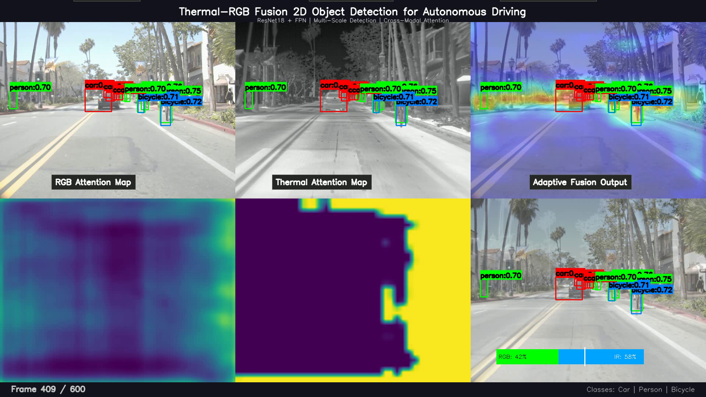
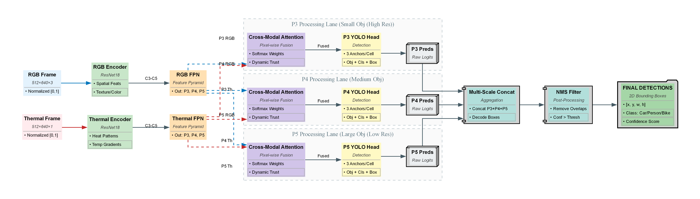
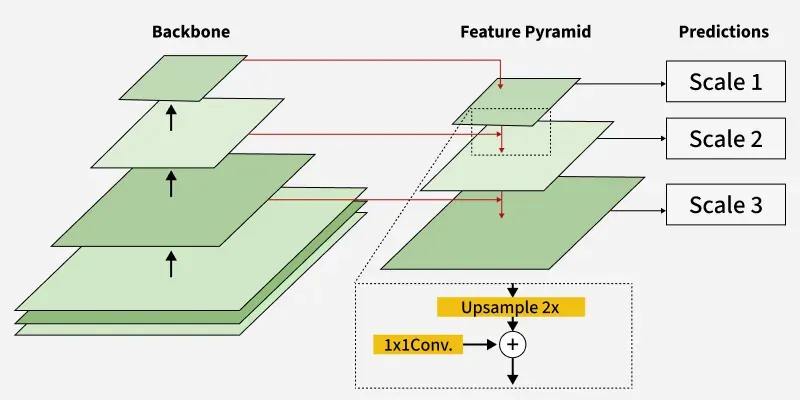

# Adaptive RGB-Thermal Fusion for 24/7 2D Object Detection

[](https://opensource.org/licenses/MIT)
[](https://pytorch.org/)
[](https://www.python.org/downloads/)

## Demo
Watch the quadrant demo video showing day-to-night transitions with adaptive attention shifting:

[]
(https://drive.google.com/file/d/14tuW8V7fiL4jW1lBqRvoarsLdZDhkr1h/view?usp=sharing)

*Click the image above to download/view the demo video*

Example visualizations:

- **Night Scene**: Thermal-dominant attention for heat signatures.
  

## Overview
This project implements a dual-encoder architecture fusing RGB and thermal imagery for robust 2D object detection in autonomous driving. Using cross-modal attention, the model dynamically trusts the appropriate sensor per pixel (e.g., RGB for daytime details, thermal for nighttime heat patterns). Built on ResNet encoders, Feature Pyramid Network (FPN), and a YOLO-style detection head, it achieves ~17% mAP@0.5 on the FLIR ADAS dataset without LiDAR.

**Key Motivation**: RGB detectors fail in low-light; thermal lacks texture. Fusion enables 24/7 perception with affordable cameras.

**Output**: 2D bounding boxes `[cx, cy, w, h]` with classes (car, person, bicycle) and confidence scores.

## Key Features
- **Dual Encoders**: Separate ResNet18/50 for RGB (textures/color) and thermal (heat gradients).
- **Feature Pyramid Network (FPN)**: Multi-scale features (P3, P4, P5) for detecting objects of varying sizes.
- **Cross-Modal Attention Fusion**: Pixel-wise softmax weights blend modalities adaptively (core novelty: learned "Dynamic Trust").
- **YOLO Detection Head**: Multi-anchor (3 per cell), multi-scale concatenation for dense predictions.
- **Post-Processing**: NMS to filter detections.
- **Visualizations**: Attention maps, objectness heatmaps, side-by-side RGB/thermal overlays, quadrant demo videos.
- **Training Pipeline**: Mixed-precision, Focal + GIoU loss, class weights for imbalance.
- **Dataset**: FLIR ADAS (10,228 paired RGB/thermal frames).

## Results
Achieved on FLIR ADAS validation set with ResNet18 backbone:

| Metric          | Value   | Notes |
|-----------------|---------|-------|
| mAP@0.5        | 16.98% | Primary metric |
| mAP@0.75       | 2.24%  | Stricter localization |
| Precision      | 21.76% | High false positives |
| Recall         | 36.34% | Good detection rate |
| F1-Score       | 27.22% | Harmonic mean |

**Per-Class AP@0.5**:
- Car: 21.55%
- Person: 20.29%
- Bicycle: 9.09% (challenging due to rarity/small size)

Analysis: Strong recall but precision/localization needs tuning (e.g., false positives from backgrounds, loose boxes).

## Installation
1. Clone the repo:
   ```
   git clone https://github.com/HTStrix7Coder/thermal-rgb-fusion-object-detection.git
   cd thermal-rgb-fusion-object-detection
   ```
2. Install dependencies (Python 3.8+):
   ```
   pip install -r requirements.txt
   ```
   Key libs: torch, torchvision, ultralytics, opencv-python, albumentations, mlflow, etc.

3. Download FLIR ADAS dataset (~14GB): [Official link](https://www.flir.com/oem/adas/adas-dataset-form/). Extract to `data/FLIR_ADAS_1_3/` folder.

## Usage
### Training
Run full training with MLflow logging:
```
python scripts/full_train.py
```
- Config: Batch size 6, 50 epochs, AdamW, mixed-precision on RTX 4060 Ti.
- Outputs: Checkpoints in `checkpoints/`, logs in MLflow.

### Evaluation
Evaluate a model:
```
python scripts/evaluate.py --model_path checkpoints/thermal_rgb_2d_latest_yolo_v2/best_model.pth
```
- Metrics: mAP, precision/recall/F1, per-class.
- Available checkpoints:
  - `checkpoints/thermal_rgb_2d_latest_yolo_v1/best_model.pth`
  - `checkpoints/thermal_rgb_2d_latest_yolo_v2/best_model.pth`

### Visualization
Generate detection images:
```
python scripts/visualize.py --model_path checkpoints/thermal_rgb_2d_latest_yolo_v2/best_model.pth --image_path data/FLIR_ADAS_1_3/val/RGB/FLIR_08863.jpg
```
- Outputs: Overlays on RGB/thermal, attention maps in `results/visualizations/`.
- Example dataset images: `data/FLIR_ADAS_1_3/val/RGB/` or `data/FLIR_ADAS_1_3/train/RGB/`

### Demo Video
Create quadrant video:
```
python scripts/detection_video.py
```
- Uses checkpoint: `checkpoints/thermal_rgb_2d_latest_yolo_v1/best_model.pth` or `checkpoints/thermal_rgb_2d_latest_yolo_v2/best_model.pth`
- Output: `results/detection_demo_final_v2.mp4`
- FPS: 8, frames: 600 for smooth playback.
- Note: Script automatically loads the model and processes validation data.

## Architecture




1. Inputs: Normalized RGB/Thermal frames (512x640).
2. Encoders: ResNet18 → C3-C5 features.
3. FPN: Pyramid levels P3-P5.
4. Fusion: Cross-modal attention at each level.
5. Detection: YOLO head → predictions → NMS → final boxes.

## Dataset
- **FLIR ADAS v1.3**: Located in `data/FLIR_ADAS_1_3/`
  - Train: 8,347 RGB images + 8,862 thermal images
  - Val: 1,257 RGB images + 1,366 thermal images
  - Video: 4,195 RGB images + 4,224 thermal images
- Classes: Car (most), Person, Bicycle (rare)
- Annotations: JSON files in each split directory (`thermal_annotations.json`)
- Augmentations: Flip, affine, brightness/contrast, noise (albumentations)

## Training Details
- Loss: Focal (class imbalance), GIoU (boxes), weights adjusted for multi-scale/anchors.
- Hyperparams: LR 1.5e-4, warmup 5 epochs, cosine annealing.
- Variants: ResNet18/50, single/multi-scale, 1/3 anchors.

## Novel Contributions
1. Learned pixel-wise attention for adaptive RGB-thermal trust.
2. Multi-scale YOLO integration for varying object sizes.
3. Comprehensive pipeline: Training, eval, vis, demos.
4. Ablation-ready: Compare RGB-only, thermal-only, fusion.

## Code Structure
```
├── Models/                # Encoders, FPN, Attention, Heads
│   ├── model.py
│   ├── model_yolo.py
│   └── dataset.py
├── utils/                 # Losses, annotations
│   ├── loss_2d.py
│   └── annotations.py
├── scripts/               # Main scripts
│   ├── full_train.py
│   ├── evaluate.py
│   ├── visualize.py
│   ├── detection_video.py
│   └── create_architecture_diagram.py
├── Config/                # Configuration files
│   ├── clean_pairs.json
│   └── dataset_info.json
├── setup/                 # Setup and verification scripts
│   ├── test.py
│   └── verifypairs.py
├── data/                  # FLIR ADAS dataset
│   └── FLIR_ADAS_1_3/
│       ├── train/
│       ├── val/
│       └── video/
├── checkpoints/           # Model weights
│   ├── thermal_rgb_2d_latest_yolo_v1/
│   └── thermal_rgb_2d_latest_yolo_v2/
├── results/               # Outputs, videos, visualizations
│   ├── detection_demo_final_v1.mp4
│   ├── detection_demo_final_v2.mp4
│   ├── Workflow_diagram.png
│   ├── Feature-Pyramid-Network.png
│   ├── visualizations/
│   └── evaluation_metrics_*.json
├── requirements.txt
├── ProjectReadme.md
└── hyperparameters.json
```

## Challenges & Lessons
Documented 14 resolved errors (e.g., multi-scale bugs, loss normalization). Key learnings: Use `.reshape()` over `.view()`, verify multi-scale in losses.

## Future Improvements
- Reduce FPs: Tune λ_noobj, better negative sampling.
- Localization: Advanced assigners (TAL), anchor optimization.
- Extensions: Temporal tracking, depth branch.
- Performance: ResNet50, stronger augs, pretraining.

## Acknowledgments
Built solo as an personal project. Uses FLIR ADAS dataset, PyTorch, Ultralytics YOLO.

For questions: [harinderant077@gmail.com](mailto:harinderant077@gmail.com)

Last updated: January 2026
