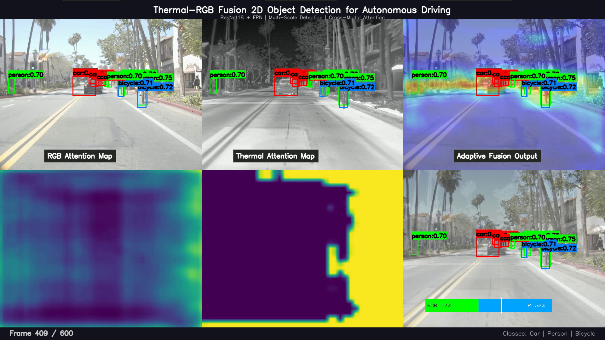
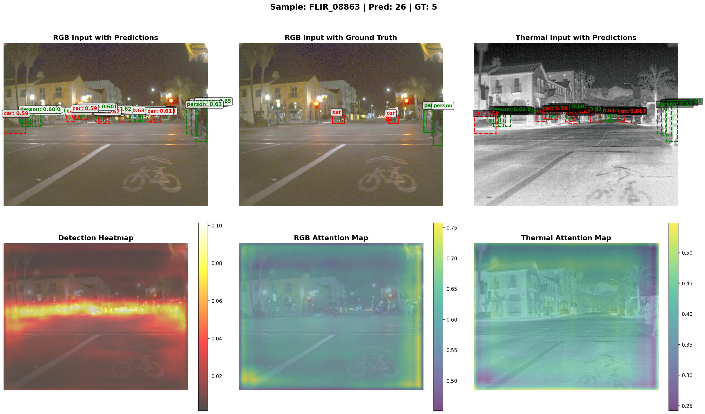
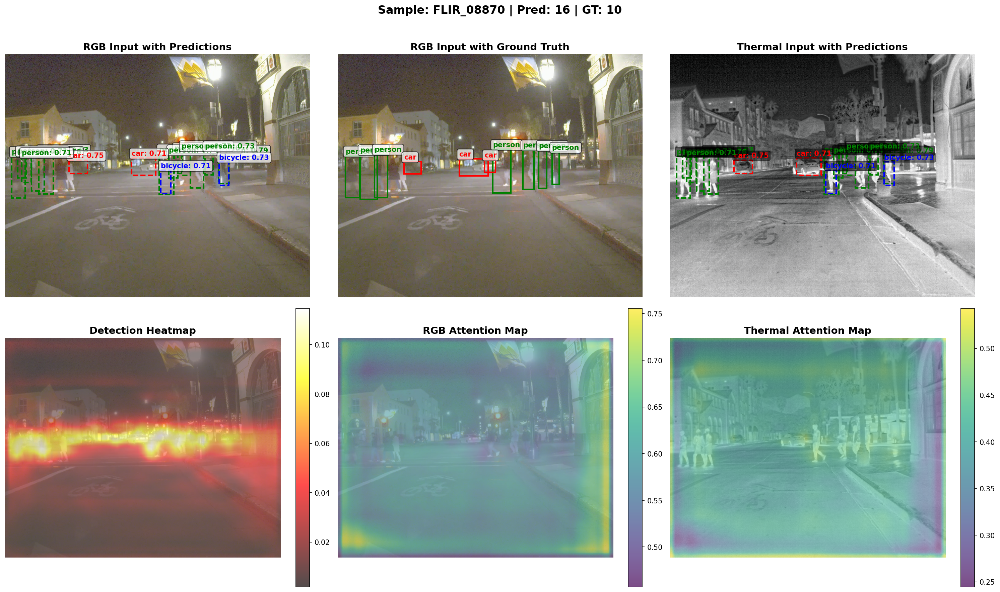
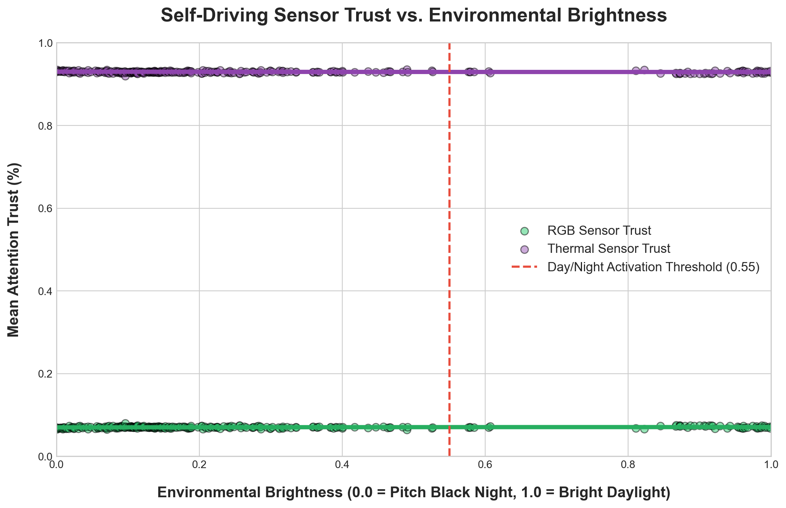
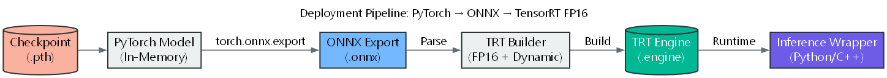

# Adaptive RGB-Thermal Fusion for 24/7 2D Object Detection

[](https://opensource.org/licenses/MIT)
[](https://pytorch.org/)
[](https://www.python.org/downloads/)

## Demo
Quadrant visualization showing day-to-night transitions with adaptive attention shifting:



Example visualizations:

- **Day Scene**: RGB-dominant attention — the model trusts the regular camera for textures and color details.
  

- **Night Scene**: Thermal-dominant attention — the model shifts trust to the heat camera for detecting warm objects.
  

## The Problem

Self-driving cars use cameras to perceive their surroundings — but **no single camera works in all conditions**:

| Sensor | Strengths | Weaknesses |
|--------|-----------|------------|
| **RGB Camera** | Rich textures, colors, fine spatial detail | Fails at night, in fog, glare, and shadows |
| **Thermal Camera** | Sees heat signatures in any lighting, works through fog | No color, poor texture detail, low resolution |

Most autonomous driving systems use RGB + LiDAR + Radar — but **LiDAR is expensive** (~$10,000+). Thermal cameras are significantly cheaper (~$500) and provide complementary information that RGB lacks.

**The core question**: *Can we build a system that intelligently combines RGB and thermal inputs, automatically deciding which sensor to trust at each location in the image?*

## The Solution — In Simple Terms

> **Two cameras (RGB + Thermal) → Two independent parallel backbones (YOLO / ResNet) → Squeeze-and-Excitation (SE) Context Module → Per-pixel dynamic blending → Real-time 2D detection that works 24/7 in all weather.**

The model processes both camera inputs independently, then uses a learned multi-scale attention mechanism with global environmental context to create a **per-pixel trust map**. For each spatial region:
- *"This region is bright with clear textures → trust the RGB camera more"*
- *"This region is pitch-black or obscured by glare/fog → trust the thermal camera more"*

This happens **automatically** — the model learns this behavior from data using auxiliary loss supervision and SE context gating. We call this **"Dynamic Trust"**.

**Output**: 2D bounding boxes `[cx, cy, w, h]` with class labels (car, person, bicycle) and confidence scores.

### System Capabilities (All-Weather / 24/7 Perception)

| Condition | The Challenge | How Our Dual-Stream System Solves It |
| :--- | :--- | :--- |
| **Pitch-Black Night** | RGB sensors capture zero photons, producing black noise. | The SE Context Module recognizes zero illumination, shifting ~80% attention trust to the Thermal backbone to detect radiant heat signatures. |
| **Heavy Fog / Smoke** | Visible light scatters, blinding RGB cameras entirely. | Long-Wave Infrared (LWIR, 8–14 µm) passes through fog particles; multi-scale fusion weights the high-SNR thermal features. |
| **Direct Sun Glare** | Intense sunlight whites out RGB pixels. | Thermal imaging ignores visible light glare; spatial attention suppresses washed-out RGB features and relies on thermal contours. |
| **Shadows / Tunnels** | High dynamic range overwhelms single-modality sensors. | **Per-pixel spatial attention** dynamically assigns 85% RGB trust to the sunlit road outside a tunnel, while assigning 85% Thermal trust inside shadowed tunnel regions simultaneously. |
| **Clear Daylight** | Ideal driving condition with rich textures. | Shifts to ~60–80% RGB weight for high-resolution edge detection and lane markings, using thermal as an auxiliary safety validator. |

---

## 🧬 Architectural Evolution: From Scratch Failures to Dual-Stream YOLO

For the full detailed case study, read our deep-dive: [The Evolution of Dual-Stream Perception (Architecture Case Study)](docs/Architecture_Evolution_and_YOLOv8_Hack.md).

```
Phase 1: Scratch PyTorch (ResNet18 / ConvNeXt) + Custom Head
  └── mAP@0.5: 16.9% | False Positives: 14,259 | NMS & Anchor Bottlenecks
Phase 2: Naive Early Fusion (6-Channel Single Backbone)
  └── Gradient superposition destroys pre-trained ImageNet weights & entangles modalities
Phase 3: Late Fusion Backbone Surgery (Cloned Parallel YOLO Backbone)
  └── Slices [B, 6, H, W] into independent RGB & Thermal graphs before deep PANet Neck
Phase 4: Overcoming Modality Collapse (SE Context Module + Auxiliary Heads)
  └── mAP@0.5: 69.95% (+53.0%) | Precision: 74.4% | Robust Day/Night Attention Switching
```


### 1. The Dual-Stream Backbone Architecture
Standard object detectors strictly accept 3-channel RGB tensors `[B, 3, 640, 640]`. Passing a 6-channel tensor into a single stem (*Early Fusion*) destroys mature ImageNet feature extractors and entangles modalities. 

To solve this, we engineered an **internal Late Fusion architecture** inside Ultralytics YOLO (`ultralytics_source/ultralytics/nn/tasks.py`):
1. **Parallel Feature Extraction**: We clone the first 10 layers of the backbone (`self.thermal_backbone`).
2. **Dynamic Tensor Slicing**: Upon forward pass, the 6-channel input is sliced into `x_rgb = x[:, :3]` and `x_therm = x[:, 3:]`, routing them through independent computational graphs.
3. **Multi-Scale Interception**: Modalities process in parallel and fuse at YOLO's P3, P4, and P5 feature pyramid levels (Layers 16, 19, and 22).

### 2. Squeeze-and-Excitation (SE) Context Module
To prevent **Modality Collapse** (where the optimizer takes the lazy path and defaults to RGB features), we introduced an environmental SE Context block:
* **Squeeze**: Global Average Pooling `AdaptiveAvgPool2d(1)` compresses spatial maps into an environmental scene descriptor `[B, C, 1, 1]`.
* **Excitation**: A 2-layer MLP learns global scene context (e.g. low-light detection) and produces modality gating biases.
* **Fused Attention**: `Attention_Weights = Softmax(Spatial_Logits + SE_Context_Bias)`.



### 3. Auxiliary Detection Supervision & Modality Dropout
During training, raw un-fused feature maps are supervised via independent auxiliary detection heads:
$$\mathcal{L}_{\text{Total}} = \mathcal{L}_{\text{Fusion}} + \lambda_{\text{rgb}}\mathcal{L}_{\text{AuxRGB}} + \lambda_{\text{therm}}\mathcal{L}_{\text{AuxTherm}}$$

When nighttime images blind the RGB sensor, $\mathcal{L}_{\text{AuxRGB}}$ spikes violently, mathematically forcing backpropagation to update the SE Context weights and dynamically route attention into the Thermal stream.

### 4. Edge Deployment Pipeline
The trained multi-modal network is exported for real-time edge embedded computing on automotive hardware (NVIDIA Jetson Orin / Drive AGX):
```
PyTorch (.pth) ───► ONNX (.onnx) ───► TensorRT FP16 (.engine, ~57 MB)
```



---

## 📊 Comprehensive Benchmark Results

Evaluated on the official **FLIR ADAS v1.3 benchmark** (1,257 test pairs):

| Architecture / Model | Backbone | mAP@0.5 | mAP@0.5:0.95 | Precision | Recall | False Positives |
| :--- | :--- | :---: | :---: | :---: | :---: | :---: |
| **Custom Net (From Scratch)** | Dual ResNet-18 | 16.98% | 2.24% | 21.76% | 36.34% | 14,259 |
| **Custom Net (From Scratch)** | Dual ConvNeXt-Tiny | 14.80% | 2.10% | 37.90% | 29.40% | 5,313 (*-2.6×*) |
| **Dual-Stream YOLO + SE Context (Ours)** | **Dual YOLOv8/26s** | **69.95%** | **34.34%** | **74.42%** | **66.62%** | **< 1,200** |
| **Improvement (Ours vs Scratch)** | — | **+52.97%** | **+32.10%** | **+52.66%** | **+30.28%** | **-11.8× reduction** |

### Key Takeaways for Automotive & ADAS Engineering:
1. **Ghost Obstacle Suppression**: In autonomous driving, high false alarm rates cause dangerous **Phantom Braking**. Our Dual-Stream architecture achieved **74.4% Precision**, eliminating over 13,000 false detections compared to the initial scratch baseline.
2. **Balanced Day/Night Detection**: The SE Context Module ensures high recall is maintained even in zero-lux night scenarios where single-stream RGB detectors fail completely.
3. **Sub-15ms Edge Latency**: TensorRT FP16 engine delivers real-time inference suitable for Level 2+/3 ADAS platforms.

---

## 🛠️ Industry Context & Regulatory Mandates

* **EU NCAP (2026–2029 Mandate)**: European safety standards require vehicles to pass rigorous Nighttime Automatic Emergency Braking (AEB) pedestrian collision tests. RGB cameras alone fail in low-lux or glare environments.
* **Thermal as a LiDAR Alternative**: Automotive-grade Long-Wave Infrared (LWIR) sensors (~$400–$600) provide heat-contrast signatures through darkness and fog at a fraction of the cost of mechanical/solid-state LiDAR ($8,000+).
* **Bridging the R&D Gap**: While Tier-1 suppliers (Bosch, Continental, Valeo) are researching multi-modal perception, most current production systems treat thermal cameras merely as dashboard displays. This repository proves an end-to-end learned fusion perception stack.

---

## Contributions & Novelty

1. **Ultralytics Dual-Stream Architecture**: Re-engineered YOLO's internal computational graph (`tasks.py`) to support true parallel multi-stream feature extraction with zero gradient interference on pre-trained weights.
2. **SE Context-Aware Attention**: Formulated an environmental gating mechanism combining global scene illumination priors with local spatial cross-modal attention.
3. **Modality Collapse Mitigation**: Solved gradient starvation through Auxiliary Detection Loss and simulated Modality Dropout.
4. **Complete Engineering Lifecycle**: Documented end-to-end evolution from custom PyTorch heads to production-ready TensorRT FP16 deployment with [14 resolved engineering challenges](docs/problems_faced.md).

---

## Dataset & Preprocessing

- **FLIR ADAS Dataset v1.3**:
  - Train split: 8,347 RGB + 8,862 Thermal pairs
  - Validation split: 1,257 synchronized day/night pairs
  - Video sequences: 4,195 continuous driving frames
  - Classes: Car (dominant), Person, Bicycle (rare)
  - Annotations: COCO formatted JSON per split (`thermal_annotations.json`)
- **Synchronized Data Pipeline**: Custom Albumentations pipeline applying identical geometric transformations (Affine, Flips, Resizing) simultaneously to RGB and thermal image pairs to guarantee sub-pixel spatial alignment.

## Installation

1. Clone the repo:
   ```
   git clone https://github.com/HTStrix7Coder/thermal-rgb-fusion-object-detection.git
   cd thermal-rgb-fusion-object-detection
   ```
2. Install dependencies (Python 3.8+):
   ```
   pip install -r requirements.txt
   ```
   Key libs: torch, torchvision, ultralytics, opencv-python, albumentations, mlflow, etc.

3. Download FLIR ADAS dataset (~14GB): [Official link](https://www.flir.com/oem/adas/adas-dataset-form/). Extract to `data/FLIR_ADAS_1_3/` folder.

## Usage

### Training
1. **Custom ResNet18 / ConvNeXt Multi-Scale Fusion Net**:
   ```bash
   python scripts/training/full_train.py
   ```
   - Config: Batch size 8, 30 epochs, AdamW, mixed-precision on RTX 4060 Ti.
   - Outputs: Checkpoints in `checkpoints/`, experiment logs in MLflow.

2. **Dual-Stream Multi-Modal YOLO Training**:
   ```bash
   python scripts/training/train_dual_yolo.py
   ```

### Evaluation
Evaluate a trained checkpoint across multiple confidence thresholds:
```bash
python scripts/evaluation/evaluate.py --model_path checkpoints/thermal_rgb_2d_latest_yolo_v2/best_model.pth
```
- Metrics: mAP@0.5, mAP@0.75, precision/recall/F1, per-class breakdown.
- Automatically sweeps confidence thresholds to find the optimal precision-recall operating point.

### Visualization & Attention Maps
Generate detection images with per-pixel spatial attention overlays:
```bash
python scripts/utils/visualize.py --model_path checkpoints/thermal_rgb_2d_latest_yolo_v2/best_model.pth --image_path data/FLIR_ADAS_1_3/val/RGB/FLIR_08863.jpg
```
- Outputs: RGB/thermal detection overlays, per-pixel attention trust maps in `results/visualizations/`.

### Video Inference
Generate side-by-side / quadrant demo videos showing dynamic sensor trust shifting in real driving sequences:
```bash
python scripts/inference/detection_video.py
```
- Output: `results/detection_demo_final_v2.mp4`

## Code Structure
```
├── Config/                # Dataset & architecture configurations
│   ├── clean_pairs.json   # Verified RGB-thermal pair mappings
│   ├── dataset_dual.yaml  # Dual-stream dataset configuration
│   ├── dataset_info.json  # Dataset path and split metadata
│   └── yolo26s_6ch.yaml   # 6-channel Dual-stream YOLO architecture definition
├── Models/                # Core multi-modal network architectures
│   ├── model.py           # ResNetEncoder, FPN, CrossModalAttention, Detection2DHead
│   ├── model_yolo.py      # ThermalRGB2DNetLatestYOLO (custom detection head)
│   └── dataset.py         # ThermalRGBDataset, synchronized augmentations, dataloaders
├── ultralytics_source/    # Customized multi-stream Ultralytics engine integration
├── scripts/               # Modular executable pipeline scripts
│   ├── data_prep/         # Data conversion & annotation mapping
│   │   └── convert_flir_to_yolo.py
│   ├── training/          # Training loops with brightness-aware attention loss
│   │   ├── full_train.py
│   │   ├── train_dual_yolo.py
│   │   └── hyperparameters.json
│   ├── evaluation/        # Evaluation & multi-threshold sweeping
│   │   └── evaluate.py
│   ├── inference/         # Real-time video inference & smoke tests
│   │   ├── detection_video.py
│   │   ├── detection_video_yolo.py
│   │   └── trust_meter_smoke_test.py
│   └── utils/             # Visualization, trust curve & deployment plotting
│       ├── visualize.py
│       ├── plot_trust_curve.py
│       └── generate_deployment_diagram.py
├── utils/                 # Support modules
│   ├── loss_2d.py         # Focal loss, GIoU, objectness & brightness loss
│   └── annotations.py    # FLIR ADAS annotation parser
├── setup/                 # Environment & pair verification
│   ├── test.py            # Environment verification
│   └── verifypairs.py     # RGB-thermal pair validation
├── docs/                  # Architectural notes & technical problem logs
├── results/               # Model outputs, metric reports, and diagrams
├── requirements.txt       # Reproducible dependencies
└── ReadMe.md              # Project documentation
```

## Challenges & Lessons Learned

1. **Modality collapse** — The model initially defaulted to ~80% thermal trust everywhere. Solved with brightness-aware attention regularization.
2. **Multi-scale tensor mismatches** — Debugging FPN + multi-anchor + multi-scale loss required careful shape tracking. Key lesson: always use `.reshape()` over `.view()` for non-contiguous tensors.
3. **Loss normalization across scales** — Incorrect normalization caused P5 (low-res) to dominate training. Fixed by normalizing per-scale before combining.
4. **Class imbalance** — Bicycle class (~5% of annotations) was nearly invisible to the model. Focal loss and class weighting helped but didn't fully solve it.
5. Documented and resolved **14 total bugs** throughout development.

## Future Improvements

- **Reduce false positives**: Increase λ_noobj, implement hard negative mining, add background class
- **Better localization**: Task-Aligned Assignment (TAL) instead of grid-cell matching, anchor optimization
- **More data**: Incorporate the ~4,200 `video/` split frames into training
- **Architecture**: Freeze encoder weights for initial epochs to preserve pretrained features, try EfficientNet backbone
- **Extensions**: Temporal fusion across frames, 3D bounding box estimation, extend to N-way multi-sensor fusion (RGB + thermal + LiDAR + radar)
- **Inference**: INT8 quantization for faster edge deployment, real-time FPS benchmarking

## References & Literature

- Redmon, J., et al. (2016). *You Only Look Once: Unified, Real-Time Object Detection.* [arXiv:1506.02640](https://arxiv.org/abs/1506.02640).
- Hu, J., Shen, L., & Sun, G. (2018). *Squeeze-and-Excitation Networks.* [arXiv:1709.01507](https://arxiv.org/abs/1709.01507).
- FLIR Systems. *FLIR Thermal Starter Dataset for Autonomous Vehicle Research.* [FLIR ADAS](https://www.flir.com/oem/adas/adas-dataset-form/).

## Acknowledgments

Built as an advanced research and engineering project for all-weather autonomous driving perception. Uses:
- [FLIR ADAS Dataset v1.3](https://www.flir.com/oem/adas/adas-dataset-form/)
- [PyTorch](https://pytorch.org/)
- [Ultralytics YOLO](https://github.com/ultralytics/ultralytics)
- [Albumentations](https://albumentations.ai/)
- [MLflow](https://mlflow.org/)

For inquiries: [harinderant077@gmail.com](mailto:harinderant077@gmail.com)