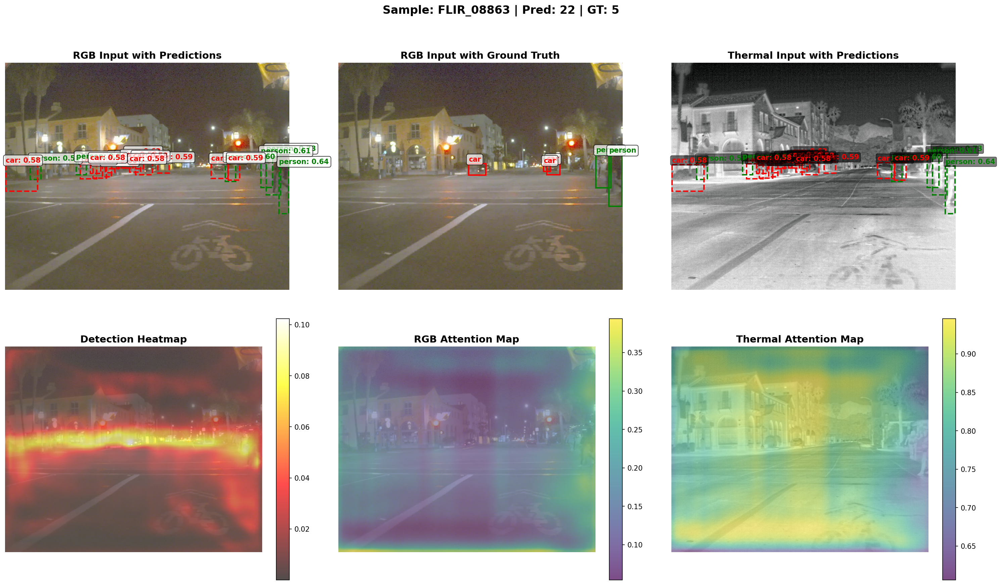
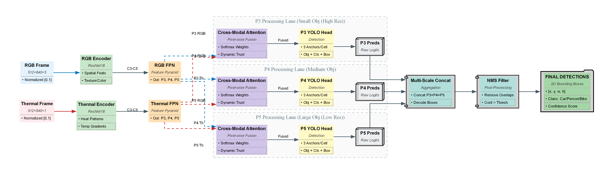
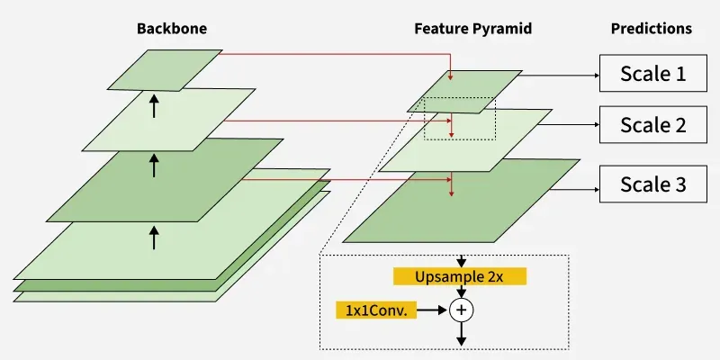

# Adaptive RGB-Thermal Fusion for 24/7 2D Object Detection

[](https://opensource.org/licenses/MIT)
[](https://pytorch.org/)
[](https://www.python.org/downloads/)

Example visualizations:

- **Day Scene**: RGB-dominant attention — the model trusts the regular camera for textures and color details.
  

- **Night Scene**: Thermal-dominant attention — the model shifts trust to the heat camera for detecting warm objects.
  

## The Problem

Self-driving cars use cameras to perceive their surroundings — but **no single camera works in all conditions**:

| Sensor | Strengths | Weaknesses |
|--------|-----------|------------|
| **RGB Camera** | Rich textures, colors, fine spatial detail | Fails at night, in fog, glare, and shadows |
| **Thermal Camera** | Sees heat signatures in any lighting, works through fog | No color, poor texture detail, low resolution |

Most autonomous driving systems use RGB + LiDAR + Radar — but **LiDAR is expensive** (~$10,000+). Thermal cameras are significantly cheaper (~$500) and provide complementary information that RGB lacks.

**The core question**: *Can we build a system that intelligently combines RGB and thermal inputs, automatically deciding which sensor to trust at each location in the image?*

## The Solution — In Simple Terms

> **Two cameras (RGB + thermal) → two separate "brains" (ResNet18) → a smart per-pixel blending module → object detection that works day AND night.**

The model processes both camera inputs independently, then uses a learned attention mechanism to create a **per-pixel trust map**. For each spatial region:
- *"This region is bright → trust the RGB camera more"*
- *"This region is dark → trust the thermal camera more"*

This happens **automatically** — the model learned this behavior from data, not from handcoded rules. We call this **"Dynamic Trust"**.

**Output**: 2D bounding boxes `[cx, cy, w, h]` with class labels (car, person, bicycle) and confidence scores.

### System Capabilities (All-Weather / 24/7 Perception)
Because of the Cross-Modal Attention module, the system dynamically manages different weather and lighting conditions by automatically choosing the most reliable camera pixel-by-pixel:

| Condition | The Problem | How the System Manages It |
|-----------|-------------|----------------------------|
| **Pitch-Black Night** | RGB sensors capture zero photons, outputting black noise. | The brightness-aware loss detects a dark scene and dynamically shifts ~80% of the attention weight to the Thermal Encoder, which captures body heat seamlessly in the dark. |
| **Heavy Fog / Smoke** | Visible light scatters, blinding RGB cameras entirely. | Long-Wave Infrared (LWIR) wavelengths (8-14 µm) pass right through fog droplets. The network recognizes the higher signal-to-noise ratio in the thermal features and confidently weights them. |
| **Direct Sun Glare** | Strong sunlight completely washes out RGB sensors (whiteout pixels). | The thermal camera ignores visible light glare. The attention module down-weights the whiteout RGB pixels and trusts the thermal map to track the vehicles ahead. |
| **Shadows / Tunnels** | High-contrast scenes surpass RGB dynamic range. | Our **per-pixel spatial attention** handles this flawlessly. It can assign 85% RGB trust to the sunny road outside the tunnel, and simultaneously in the same frame, assign 85% Thermal trust to the shadows inside the tunnel. |
| **Clear Daylight** | Ideal driving condition without obstructions. | The system shifts to ~60-80% RGB weight, capturing high-resolution textures, colors, and lane markings, demoting thermal to a backup sensor for unusual heat signatures. |

## Architecture — How It Works



### Stage 1: Dual-Encoder Feature Extraction

Two **separate** ResNet18 networks (not weight-shared) process each modality independently:

```
RGB Image (512×640×3)     →  ResNet18 #1  →  "I see textures, edges, colors"
Thermal Image (512×640×3) →  ResNet18 #2  →  "I see heat patterns, warm blobs"
```

Each encoder outputs hierarchical features at 3 scales:
- **C3** (64×80) — fine-grained details (edges, small features)
- **C4** (32×40) — medium-level patterns (object parts)
- **C5** (16×20) — high-level semantics (whole objects)

**Why ResNet18?** With ~8,300 training samples, a larger backbone like ResNet50 (~50M params) would overfit. ResNet18 (~22M params) provides a better parameter-to-data ratio.

**Why two separate encoders?** RGB and thermal images have fundamentally different statistics — RGB has 3 color channels with textures, thermal is essentially grayscale with heat gradients. Separate encoders allow each to specialize.

### Stage 2: Feature Pyramid Network (FPN)



Separate FPNs for RGB and thermal refine the multi-scale features:

| Pyramid Level | Resolution | What It's Good At |
|---------------|------------|-------------------|
| **P3** | 64×80 | Small objects (distant pedestrians, bicycles) |
| **P4** | 32×40 | Medium objects (nearby persons) |
| **P5** | 16×20 | Large objects (close cars) |

All pyramid levels are unified to 256 channels, enabling consistent fusion and detection at every scale.

### Stage 3: Cross-Modal Attention Fusion (Core Innovation)

This is where the magic happens. At **each FPN level independently**, a `CrossModalAttention` module decides how to blend the two modalities:

```
Step 1: Compress RGB features (256ch → 32ch) using 1×1 convolution
Step 2: Compress Thermal features (256ch → 32ch) using 1×1 convolution
Step 3: Concatenate → 64 channels
Step 4: 1×1 convolution → 2 channels → Softmax along the modality dimension

Result: Two weight maps that sum to 1.0 at every spatial location
  - rgb_weight[i,j]     (e.g., 0.8 in a bright region)
  - thermal_weight[i,j]  (e.g., 0.2 in the same region)

Step 5: Fused = rgb_weight × RGB_features + thermal_weight × Thermal_features
```

**Key insight**: The softmax creates a **competitive** relationship — if RGB weight goes up, thermal weight must go down (and vice versa). This forces the model to make a meaningful choice per spatial location.

**Every grid cell gets its own weights**, so in a single image:
- A sunlit road area → RGB weight ≈ 0.85, Thermal ≈ 0.15
- A shadowed pedestrian → RGB weight ≈ 0.25, Thermal ≈ 0.75
- A night scene → RGB weight ≈ 0.15, Thermal ≈ 0.85

The fusion happens independently at P3, P4, and P5, allowing **scale-specific trust decisions** (e.g., thermal might be more useful for detecting small heat sources at P3, while RGB is better for large, textured objects at P5).

### Stage 4: Brightness-Aware Attention Regularization

**The problem**: During initial training, the model suffered from **modality collapse** — it relied on thermal ~80% of the time across ALL images, even in bright daylight. This happened because thermal provides a "cleaner" signal (warm objects on cool backgrounds), making it an easy shortcut for the optimizer.

**The solution**: A custom regularization loss that uses mean pixel brightness as a proxy for scene illumination:
- Bright scene (brightness > 0.55): Nudge the model toward ~60% RGB, ~40% thermal
- Dark scene (brightness ≤ 0.55): Nudge toward ~30% RGB, ~70% thermal

This acts as a **soft, physics-informed prior** — the model is free to override it when the data suggests otherwise, but it prevents the lazy shortcut of always defaulting to thermal.

After adding this regularization, the attention maps showed clear day/night differentiation — exactly what we'd expect from a physically meaningful fusion.

### Stage 5: Custom Detection Head (YOLO-Inspired Design)

The fused features feed into a custom-built detection head that follows the YOLO prediction format — predicting per grid cell:

1. **Objectness score** — "Is there an object here?" (0 to 1)
2. **Class probabilities** — [car, person, bicycle] via softmax
3. **Bounding box regression** — [center_x, center_y, width, height] normalized coordinates

The detection head was built from scratch using standard convolutional layers and trained entirely on the FLIR ADAS dataset — it does not use any pretrained YOLO weights. It doesn't know the features came from a fusion — it just receives well-formed feature maps and makes predictions. Each FPN level has its own detection head, and predictions from all 3 scales are upsampled and concatenated before output.

> **Note**: While the detection head follows YOLO's prediction format (objectness + class + bbox per grid cell with anchors), it is NOT the Ultralytics YOLO model. Standard YOLO only accepts a single input stream — it cannot natively handle dual-encoder RGB-thermal fusion. This is why the detection head was custom-built, giving full control over the multi-modal architecture.

### Stage 6: Post-Processing

Raw predictions go through:
1. **Confidence thresholding** — filter low-confidence detections
2. **Non-Maximum Suppression (NMS)** — remove overlapping duplicate boxes
3. **Grid-to-pixel coordinate decoding** — convert normalized outputs to image-space bounding boxes

## Training Pipeline

### Multi-Component Loss Function

| Loss Component | Purpose | Why It's Needed |
|----------------|---------|-----------------|
| **Focal Loss** (classification & objectness) | Down-weights easy examples, focuses on hard ones | Handles severe class imbalance — bicycle is rare, background cells are abundant |
| **GIoU Loss** (bounding box regression) | Penalizes non-overlapping boxes more than L1/L2 | Better localization, especially for distant or small objects |
| **Objectness BCE** | Learns foreground vs background | Standard detection objective |
| **Brightness-Aware Attention Loss** | Prevents modality collapse | Physics-informed regularization (see Stage 4 above) |

### Training Configuration
- **Optimizer**: AdamW (LR: 5e-5, weight decay: 5e-5)
- **Schedule**: Linear warmup (3 epochs) + cosine annealing
- **Mixed Precision**: FP16 via `torch.cuda.amp` (~2× speedup)
- **Batch Size**: 8 on RTX 4060 Ti (8GB VRAM)
- **Augmentations**: Horizontal flip, affine, brightness/contrast jitter, Gaussian noise, Gaussian blur, CoarseDropout — same transform applied to both RGB and thermal to maintain spatial alignment

### Deployment
The trained model is exported through the full deployment pipeline:
```
PyTorch (.pth) → ONNX (.onnx) → TensorRT FP16 (.engine, ~57 MB)
```
The TensorRT engine enables real-time inference on NVIDIA edge hardware.

## Results

Achieved on FLIR ADAS validation set (1,257 images) with ResNet18 backbone:

| Metric          | Value   | Notes |
|-----------------|---------|-------|
| mAP@0.5        | 16.98% | Primary metric |
| mAP@0.75       | 2.24%  | Stricter localization |
| Precision      | 21.76% | Room for improvement (high false positives) |
| Recall         | 36.34% | Good detection rate |
| F1-Score       | 27.22% | Harmonic mean |

**Per-Class AP@0.5**:
- Car: 24.06%
- Person: 19.56%
- Bicycle: 2.02% (challenging — only 420 validation samples)

### Backbone Ablation Study: ResNet18 vs. ConvNeXt-Tiny
To validate the impact of feature extraction scale on our multi-modal fusion, we conducted an ablation study substituting the dual ResNet18 encoders (~22M parameters) with modern ConvNeXt-Tiny encoders (~57M parameters). 

| Metric | ResNet18 | ConvNeXt-Tiny | Improvement |
|--------|----------|---------------|-------------|
| **mAP@0.5** | **15.2%** | 14.8% | -0.4% |
| **Overall Precision** | 22.8% | **37.9%** | **+15.1%** |
| **Car AP** | 24.0% | **26.7%** | **+2.7%** |
| **False Positives** | 14,259 | **5,313** | **-2.6x** |

**Key Finding — A Massive Reduction in False Positives:**
While the overall mAP remained relatively stable, checking the underlying metrics reveals that **ConvNeXt-Tiny provided a massive leap in prediction quality**. Overall Precision improved by an absolute 15.1%. More importantly, ConvNeXt-Tiny reduced False Positive "ghost" detections from 14,259 down to 5,313 (a near 3x reduction). 

This proves that the richer feature representations of the ConvNeXt architecture allow the fusion model to confidently suppress background noise rather than randomly guessing. In the context of Autonomous Driving, trading Recall for Precision to eliminate 9,000 hallucinated obstacles is a critical safety improvement. The slight drop in mAP is attributed to the larger model slightly overfitting on our constrained ~8k image dataset without enough data to maintain the high recall of the smaller ResNet model.

### Honest Analysis

The mAP is modest compared to pretrained detectors — this is expected because:
1. **Custom architecture trained from scratch** — the detection head is custom-built (not pretrained YOLO), and standard YOLO cannot handle dual-input fusion
2. **Small dataset** — only 8,347 training images vs millions used by state-of-the-art
3. **Severe class imbalance** — bicycle has very few samples
4. **Focus on fusion concept validation** — the primary goal was proving the Dynamic Trust mechanism works, not chasing benchmark numbers

The attention maps clearly show the model learns meaningful sensor trust patterns (RGB-dominant in daylight, thermal-dominant at night), validating the core contribution.

## Industry Context

**Current state of thermal in production cars (as of 2026):**
- BMW (Night Vision), Mercedes (Night View Assist), and Audi use thermal cameras as a **display-only feature** — showing the driver a grayscale thermal image on the dashboard
- **No production vehicle** currently fuses thermal data into the autonomous driving neural network pipeline
- Industry AD stacks use RGB + LiDAR + Radar, with no learned thermal fusion

**Why this matters:**
- EU NCAP regulations (2026-2029) are pushing stricter AEB (Automatic Emergency Braking) requirements, especially for nighttime pedestrian detection
- FLIR + Valeo demonstrated that thermal-enhanced AEB detects pedestrians **4× better** at night compared to camera-only systems
- Magna is researching thermal + imaging radar early fusion as a **cost-effective LiDAR alternative**

This project is a proof-of-concept for learned RGB-thermal fusion — an approach the industry will likely need as thermal cameras become cheaper and regulatory requirements grow stricter.

## Contributions & Novelty

**Existing techniques used:**
- Attention-based multi-modal fusion is an active research area (MBNet, CMX, etc.)
- The FLIR ADAS dataset is a standard benchmark for RGB-thermal detection
- FPN, focal loss, GIoU, and YOLO-style grid-based detection are established methods
- Note: Standard YOLO (Ultralytics) only supports single-input architectures — it cannot natively handle dual-encoder fusion, which is why a custom detection head was built

**Original contributions in this project:**
1. **Brightness-aware attention regularization** — a custom loss to address modality collapse, using scene brightness as a physics-informed prior for sensor trust. Independently designed to solve an observed training problem.
2. **Multi-scale independent fusion** — cross-modal attention applied separately at each FPN level (P3, P4, P5), allowing scale-specific trust decisions
3. **Complete end-to-end pipeline** — from data loading and augmentation through training, evaluation, attention visualization, demo video generation, and TensorRT FP16 deployment
4. **Documented engineering process** — 14 resolved bugs and debugging insights (e.g., `.reshape()` vs `.view()` for non-contiguous tensors, multi-scale loss normalization)

## Dataset

- **FLIR ADAS v1.3**: Located in `data/FLIR_ADAS_1_3/`
  - Train: 8,347 RGB images + 8,862 thermal images
  - Val: 1,257 RGB images + 1,366 thermal images
  - Video: 4,195 RGB images + 4,224 thermal images
- Classes: Car (dominant), Person, Bicycle (rare)
- Annotations: JSON files in each split directory (`thermal_annotations.json`)
- Augmentations: Flip, affine, brightness/contrast, color jitter, noise, blur, CoarseDropout (via albumentations)

## Installation

1. Clone the repo:
   ```
   git clone https://github.com/HTStrix7Coder/thermal-rgb-fusion-object-detection.git
   cd thermal-rgb-fusion-object-detection
   ```
2. Install dependencies (Python 3.8+):
   ```
   pip install -r requirements.txt
   ```
   Key libs: torch, torchvision, ultralytics, opencv-python, albumentations, mlflow, etc.

3. Download FLIR ADAS dataset (~14GB): [Official link](https://www.flir.com/oem/adas/adas-dataset-form/). Extract to `data/FLIR_ADAS_1_3/` folder.

## Usage

### Training
Run full training with MLflow logging:
```
python scripts/full_train.py
```
- Config: Batch size 8, 30 epochs, AdamW, mixed-precision on RTX 4060 Ti.
- Outputs: Checkpoints in `checkpoints/`, logs in MLflow.

### Evaluation
Evaluate a model:
```
python scripts/evaluate.py --model_path checkpoints/thermal_rgb_2d_latest_yolo_v2/best_model.pth
```
- Metrics: mAP@0.5, mAP@0.75, precision/recall/F1, per-class breakdown.
- Sweeps confidence thresholds automatically to find optimal operating point.
- Available checkpoints:
  - `checkpoints/thermal_rgb_2d_latest_yolo_v1/best_model.pth`
  - `checkpoints/thermal_rgb_2d_latest_yolo_v2/best_model.pth`

### Visualization
Generate detection images with attention overlays:
```
python scripts/visualize.py --model_path checkpoints/thermal_rgb_2d_latest_yolo_v2/best_model.pth --image_path data/FLIR_ADAS_1_3/val/RGB/FLIR_08863.jpg
```
- Outputs: RGB/thermal detection overlays, per-pixel attention maps in `results/visualizations/`.

### Demo Video
Create quadrant demo video showing day-to-night transitions:
```
python scripts/detection_video.py
```
- Output: `results/detection_demo_final_v2.mp4`
- FPS: 8, frames: 600 for smooth playback.

## Code Structure
```
├── Models/                # Core model architecture
│   ├── model.py           # ResNetEncoder, FPN, CrossModalAttention, Detection2DHead, ThermalRGB2DNet
│   ├── model_yolo.py      # ThermalRGB2DNetLatestYOLO (YOLO-inspired custom detection head)
│   └── dataset.py         # ThermalRGBDataset, augmentations, dataloader creation
├── utils/                 # Support modules
│   ├── loss_2d.py         # Detection loss (focal loss, GIoU, objectness)
│   └── annotations.py    # FLIR ADAS annotation parsing
├── scripts/               # Executable scripts
│   ├── full_train.py      # Full training loop with brightness-aware attention loss
│   ├── evaluate.py        # Evaluation with multi-threshold sweep
│   ├── visualize.py       # Detection + attention map visualization
│   ├── detection_video.py # Quadrant demo video generation
│   └── hyperparameters.json # All training configuration
├── Config/                # Data configuration
│   ├── clean_pairs.json   # Verified RGB-thermal pair mappings
│   └── dataset_info.json  # Dataset path info
├── setup/                 # Setup and verification
│   ├── test.py            # Environment verification
│   └── verifypairs.py     # RGB-thermal pair validation
├── data/                  # FLIR ADAS dataset
│   └── FLIR_ADAS_1_3/
│       ├── train/
│       ├── val/
│       └── video/
├── checkpoints/           # Trained model weights
│   ├── thermal_rgb_2d_latest_yolo_v1/
│   └── thermal_rgb_2d_latest_yolo_v2/
├── results/               # All outputs
│   ├── detection_demo_final_v1.mp4
│   ├── detection_demo_final_v2.mp4
│   ├── Workflow_diagram.png
│   ├── Feature-Pyramid-Network.png
│   ├── visualizations/
│   └── evaluation_metrics_*.json
├── thermal_model_fp16_3ch.engine   # TensorRT FP16 deployment engine
├── thermal_model_fp16_3ch.onnx     # ONNX export
├── yolo11n.pt                      # YOLOv11 nano weights (reference only, not used in fusion model)
├── requirements.txt
└── ProjectReadme.md
```

## Challenges & Lessons Learned

1. **Modality collapse** — The model initially defaulted to ~80% thermal trust everywhere. Solved with brightness-aware attention regularization.
2. **Multi-scale tensor mismatches** — Debugging FPN + multi-anchor + multi-scale loss required careful shape tracking. Key lesson: always use `.reshape()` over `.view()` for non-contiguous tensors.
3. **Loss normalization across scales** — Incorrect normalization caused P5 (low-res) to dominate training. Fixed by normalizing per-scale before combining.
4. **Class imbalance** — Bicycle class (~5% of annotations) was nearly invisible to the model. Focal loss and class weighting helped but didn't fully solve it.
5. Documented and resolved **14 total bugs** throughout development.

## Future Improvements

- **Reduce false positives**: Increase λ_noobj, implement hard negative mining, add background class
- **Better localization**: Task-Aligned Assignment (TAL) instead of grid-cell matching, anchor optimization
- **More data**: Incorporate the ~4,200 `video/` split frames into training
- **Architecture**: Freeze encoder weights for initial epochs to preserve pretrained features, try EfficientNet backbone
- **Extensions**: Temporal fusion across frames, 3D bounding box estimation, extend to N-way multi-sensor fusion (RGB + thermal + LiDAR + radar)
- **Inference**: INT8 quantization for faster edge deployment, real-time FPS benchmarking

## Acknowledgments

Built independently as an undergraduate academic project. Uses:
- [FLIR ADAS Dataset v1.3](https://www.flir.com/oem/adas/adas-dataset-form/)
- [PyTorch](https://pytorch.org/)
- [Ultralytics YOLO](https://github.com/ultralytics/ultralytics)
- [Albumentations](https://albumentations.ai/)
- [MLflow](https://mlflow.org/)

For questions: [harinderant077@gmail.com](mailto:harinderant077@gmail.com)

Last updated: March 2026
